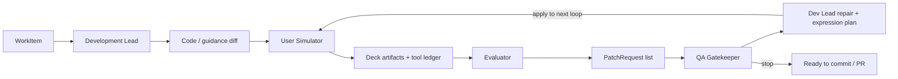

# pptcreater Development Improvement Loop

This document defines a development harness for improving **pptcreater itself**. It is separate from
the deck-authoring agents under `.github/agents/deck-*.agent.md`, which are for producing decks.
The development loop uses pptcreater as the system under test, creates real slide artifacts, routes
failures back into code or guidance changes, and stops only when deterministic gates and QA agree.

## Goal

Raise pptcreater quality through an adversarial but controlled loop:

1. implement a focused improvement,
2. simulate realistic pptcreater usage,
3. evaluate the generated slides and logs,
4. create a Dev Lead repair/improvement plan,
5. apply that plan to the next loop,
6. decide whether to continue or stop.

The evaluator and QA roles should normally run on a different model from the developer role. This
reduces self-review optimism, but model judgement is never the final gate by itself.

## Roles

| Role | Agent file | Owns | May edit code? | Typical model policy |
| --- | --- | --- | --- | --- |
| Development Lead | `.github/agents/pptcreater-dev-lead.agent.md` | WorkItem, implementation, integration | Yes | implementation-oriented model |
| User Simulator | `.github/agents/pptcreater-dev-user.agent.md` | realistic pptcreater usage scenarios and generated artifacts | No repo code edits | user-like or lower-context model |
| Evaluator | `.github/agents/pptcreater-dev-evaluator.agent.md` | artifact critique and PatchRequest creation | No | pinned to `Opus4.8` |
| QA Gatekeeper | `.github/agents/pptcreater-dev-qa.agent.md` | stop/continue decision and risk acceptance | No | pinned to `Opus4.8` |

## Core Artifacts

### WorkItem

```json
{
  "id": "dev-loop-001",
  "title": "Make architecture diagrams selectable via recommend_figure",
  "objective": "Architecture diagrams should be first-class generated figures, not fallback guidance.",
  "scope": ["packages/core/src/figureSelector.ts", "packages/core/src/figureSelector.test.ts"],
  "outOfScope": ["render-pptx internals", "template import behavior"],
  "acceptance": [
    "pptcreater figure routes architecture wording to generate_native_diagram",
    "focused tests pass",
    "full tests pass"
  ],
  "maxIterations": 3,
  "modelPolicy": {
    "developer": "implementation model",
    "userSimulator": "usage simulation model",
    "evaluator": "Opus4.8",
    "qa": "Opus4.8"
  }
}
```

### ScenarioSpec

The User Simulator writes one `ScenarioSpec` per generated test deck.
Use [`dev-loop-test-scenarios.md`](dev-loop-test-scenarios.md) as the initial catalog of
representative scenarios.

```json
{
  "id": "scenario-technical-architecture",
  "purpose": "customer-facing technical deck",
  "contentMode": "technical",
  "requiredExpressions": ["architecture", "timeline", "table", "structured-text"],
  "requiredTools": ["recommend_figure", "generate_native_diagram", "finalize", "review"],
  "expectedArtifacts": ["deck.json", "pptx", "studio.html", "review.txt", "finalize.txt"]
}
```

### EvalReport

The Evaluator turns generated artifacts into concrete development feedback.
Detailed scoring rules, required evidence, severity, and PatchRequest criteria are defined in
[`dev-loop-evaluator-criteria.md`](dev-loop-evaluator-criteria.md).
In addition to numeric scores, every EvalReport must include `slideComments` for every slide. These
comments are intentionally generative critique: each slide gets a written observation plus one
"would be better if" suggestion, even when the slide has no blocking issue. The comments are the main
input for larger tool changes such as adding or reshaping visual archetypes; scores are only the
aggregate signal.

```json
{
  "scenarioId": "scenario-technical-architecture",
  "deterministic": {
    "finalizeBlockingErrors": 0,
    "reviewBlockingIssues": 0,
    "zipZeroNonDir": 0
  },
  "modelReview": {
    "messageFit": 4,
    "visualFit": 3,
    "editability": 5,
    "toolDiscipline": 2
  },
  "slideComments": [
    {
      "slideIndex": 4,
      "slideId": "architecture",
      "title": "Architecture",
      "layout": "message-hub-map",
      "comment": "The slide explains structure, but the visual still reads like a generic grouped panel.",
      "wouldBeBetterIf": "It would be stronger if one decision point or tradeoff were made visually dominant.",
      "evidence": "layout=message-hub-map; spatialModel=true"
    }
  ],
  "patchRequests": [
    {
      "severity": "high",
      "problem": "The deck used hand-built SVG for an architecture slide.",
      "evidence": "slide 4, no generate_native_diagram call in tool ledger",
      "expected": "recommend_figure should route architecture wording to generate_native_diagram",
      "suggestedScope": ["packages/core/src/figureSelector.ts"]
    }
  ]
}
```

### QAReport

The QA Gatekeeper decides whether the loop stops.

```json
{
  "workItemId": "dev-loop-001",
  "iteration": 2,
  "decision": "continue",
  "reasons": ["scenario-technical-architecture still has high severity PatchRequest"],
  "requiredNextWork": ["Add architecture intent to recommend_figure"],
  "acceptedRisks": []
}
```

### DevLeadPlan

After every loop, the Development Lead receives the aggregated EvalReports and QA summary, then
writes a `dev-lead-plan.json`. The plan must include both correctness repairs and expression-quality
improvements when the artifacts reveal weak visual communication.

```json
{
  "role": "Development Lead",
  "loop": 2,
  "blockingCodes": {
    "visual.truncated-text": 4,
    "content.title-too-long": 2
  },
  "actions": [
    {
      "id": "compact-copy-and-labels",
      "kind": "bugfix+expression-improvement",
      "reason": "Text truncation and wrapped labels show the generated copy is too dense.",
      "changes": { "compactCopyLevel": 2, "reduceSlideDensity": true }
    },
    {
      "id": "increase-expression-polish",
      "kind": "expression-improvement",
      "reason": "Improve scanability and visual presentation in the next generated deck set.",
      "changes": { "expressionPolishLevel": 2 }
    }
  ],
  "nextLoopWillApply": true
}
```

## Loop



The deterministic runner records this cycle as:

- `input-improvement-state.json`: generation strategy used for the current loop.
- `eval-report.json` / `eval-summary.md`: scenario evaluation, including mandatory per-slide written comments.
- `dev-lead-plan.json` / `dev-lead-plan.md`: fixes and expression improvements selected after evaluation.
- `next-improvement-state.json`: strategy applied to the next loop.

The runner's automatic plan is intentionally conservative. It can change generation profile, copy
density, style safety, title length, slide density, and expression polish between loops. A human or
agent Dev Lead should use the slideComments to identify bigger tool changes, such as adding a new
visual archetype or replacing a stale diagram grammar, when the loop is merely swapping familiar
patterns without improving the artifacts.

## Deterministic Gates

Every iteration should run the cheapest relevant gates first, then widen.

Required for code changes:

- `npm run build`
- focused tests for touched modules
- `npm test -- --reporter=dot` before merge/commit

Required for generated deck artifacts:

- `pptcreater finalize <deck.json> --output <deck.pptx>` with `Blocking errors: 0`
- `pptcreater review <polished.deck.json>` with `Ready to finalize: no blocking issues`
- PPTX zip check: zero-length non-directory entries must be `0`
- source/reference checks when external URLs are used

Required for agent/tool discipline:

- role execution ledger records role, model, subagent vs in-process execution, and evidence
- User Simulator must call pptcreater CLI/MCP surfaces, not only hand-author DeckSpec
- Evaluator and QA must not modify code

## Model Separation

The Evaluator and QA Gatekeeper are pinned to `Opus4.8` in their custom-agent frontmatter. The
Development Lead and User Simulator remain host-selected unless a WorkItem overrides them. The
orchestrator must still record the actual resolved model in the ledger:

```json
{
  "role": "Evaluator",
  "agent": "pptcreater-dev-evaluator",
  "model": "Opus4.8",
  "execution": "subagent",
  "artifact": "generated/dev-loop-runs/run-001/eval-report.json"
}
```

Recommended routing:

- Development Lead: strongest implementation model available.
- User Simulator: model close to normal user behavior, sometimes deliberately less specialized.
- Evaluator: `Opus4.8`, strict critique model.
- QA Gatekeeper: `Opus4.8`, conservative model, with deterministic gates treated as authoritative.

## Failure Taxonomy

| Failure | Owner | Typical fix |
| --- | --- | --- |
| Build/test failure | Development Lead | code repair, focused tests |
| pptcreater tool not used | User Simulator or Development Lead | improve scenario prompt or guidance |
| Generated slide has blocking lint | Development Lead | fix generator / layout / schema |
| Generated slide passes lint but looks wrong | Evaluator | create PatchRequest with visual evidence |
| Generated slide is technically valid but visually weak | Development Lead | improve expression selection, copy density, scanability, or visual grammar |
| Evaluator and deterministic gates disagree | QA Gatekeeper | request human review or another scenario |
| Loop repeats without progress | QA Gatekeeper | stop, summarize blocker, lower scope |

## Minimum Viable Harness

Phase 1 is manual-but-structured:

1. Write a WorkItem.
2. Development Lead implements.
3. User Simulator creates 2-3 representative decks.
4. Evaluator writes EvalReport.
5. QA Gatekeeper decides stop/continue.

Phase 2 can add `scripts/dev-loop/` to create run folders, execute deterministic gates, and collect
artifacts automatically.

Phase 3 can run on PRs or nightly CI, but only after the manual loop produces useful PatchRequests
without excessive noise.

## Relation To Deck Authoring Agents

The existing `Deck Director`, `Deck Designer`, and related agents remain useful as the **system under
test**. They are not the same as the development loop roles above. For example, the User Simulator
may invoke `Deck Director` to create a deck, while the Evaluator checks whether that invocation used
the expected pptcreater tools and produced a high-quality artifact.